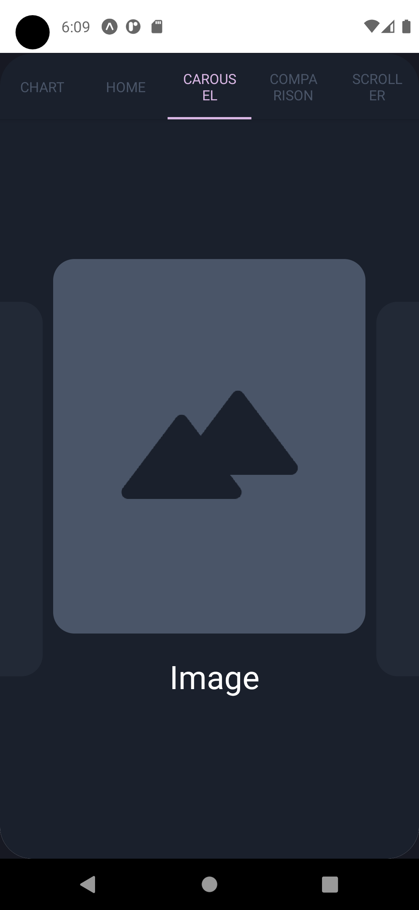

# react-native-mad-component-playground

This is a simple playground to test some custom components

## Included components

- Simple Chart/Grid - chart.js/Grid.js
   aaaa
- Collapsable home - home.js
  
- Gallery Carousel - carousel.js
  
- Image Comparison - imageComparison.js
  
- Number Scroller picker - scrollNumberPicker.js
  

...more and more

test
